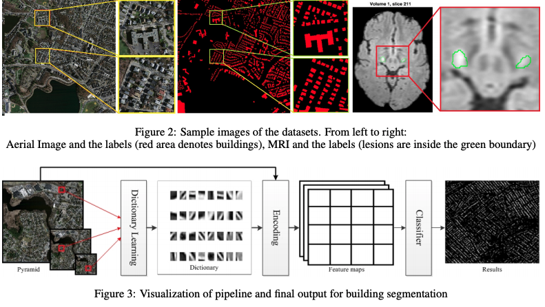

# Analysis of Unsupervised Feature Learning in Image Segmentation (buildings segmentation and multiple sclerosis lesions segmentation)
Paper: http://webdocs.cs.ualberta.ca/~zichen2/papers/lesion_report.pdf

Unsupervised feature learning was proved to be a potentially powerful tool for image segmentation as pixel-wise classification. However, there is no comprehensive study on the importance of each module of image segmentation pipeline. In this project we aim to understand the formulated variability of performance of feature learning methods in the context of image segmentation. A generic test framework was developed, then two segmentation tasks from two different domain were studied and analyzed. Through extensive experiments on buildings segmentation and multiple sclerosis lesions segmentation, different parameters are compared. Discussions about the preprocessing settings, the impact of dictionary learning, encoding and classification is presented. Our results conform in some parts with the analysis previously reported on image classification, but also new conclusions are drawn specific to the segmentation task.

## Note

Originally written by Ryan Kiros (rkiros@cs.toronto.edu) and achieved the 1st place VESSEL12 grand challenge result. The original programs are available from [here](http://www.cs.toronto.edu/~rkiros/)

## How to use

To train a classifier on the MSlesions competition data:

    - Download the MSlesions data from http://www.ia.unc.edu/MSseg/

    - Open the script 'ms_demo.m' and set the data directories. Optionally,
      open the script 'set_params.m' to modify the hyperparameters.

    - Run the script 'ms_demo.m'. This will learn features using 1 labelled
      volumes and train a logistic regression classifier using features from
      the labelled voxels with 10-fold cross validation. A sample
      segmentation is displayed.

To use the method with your own data:

    - Put your annotations in the same format as the MSlesions data. More
      specifically, each volume should have its own annotation file that 
      is in the same format as the input volume. Every pixel should have
      a label of {0,1}, with 1 indicating lesion.

    - Each volume should be a 3D array with slice indexing on the third
      dimension. For example loading/preprocessing code, check out the
      script 'load_mslesion.m' in the MSlesion08 folder.

    - From here, it should be easy to modify the 'run_mslesion.m' script
      to handle your data.

## Setup

    - It's recommended to have at least 16 GB of memory available.
      (Although 8 GB should be sufficent)

    - This code makes use of the parallel computing toolbox. If you have it 
      available, make sure to load some workers e.g. 'matlabpool open 8'. 
      This will speed up the feature extraction.

    - While we use 2 layers of feature learning for the competition, the
      number of scales is significantly more important for good vessel
      segmentation results. For simplicity and ease of use, we just include
      1 layer of learning with this code.

    - When setting the hyperparameters on your own data, try experimenting
      with the number of scales, receptive field size and number of features,
      probably in that order.

## Reference
This package reuses the following 3rd party code:

    - Mark Schmidt's minFunc optimization package (minFunc_2012):
      http://www.di.ens.fr/~mschmidt/Software/minFunc.html

    - Adam Coates' VQ code (run_omp1.m): http://www.stanford.edu/~acoates/

    - Pranam Janney's Gaussian pyramid code (Gscale.m):
      http://www.mathworks.com/matlabcentral/fileexchange/25254-gaussian-pyramid

    - Steven L. Eddins' image overlay code (imoverlay.m):
      http://www.mathworks.com/matlabcentral/fileexchange/10502-image-overlay/

    - Dirk-Jan Kroon's medical data reader code:
      http://www.mathworks.com/matlabcentral/fileexchange/29344-read-medical-data-3d/

    - Jeff Mather's NRRD format data reader
      http://www.mathworks.com/matlabcentral/fileexchange/34653-nrrd-format-file-reader

    - Bruno Luong's C implementation of min/max selection algorithm (partial quicksort)
      http://www.mathworks.com/matlabcentral/fileexchange/23576-min-max-selection

    - Chih-Chung Chang and Chih-Jen Lin, LIBSVM
      http://www.csie.ntu.edu.tw/~cjlin/libsvm
